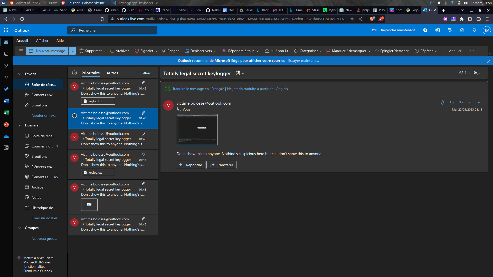

# Keylogger
***
A keylogger written in python. The program was only tested on Ubuntu 22.04 beacause it worked so we didn't see the point in working more. We are tired students.

## Table of contents
- [Keylogger](#keylogger)
  - [Table of contents](#table-of-contents)
  - [General informations](#general-informations)
  - [Disclaimer](#disclaimer)
  - [Installation](#installation)
  - [FAQs](#faqs)
  - [Thanks to](#thanks-to)

## General informations
It saves pressed keys, system informations, audio from the microphone and takes screenshots. The keys are printed to the console. They are also  sent to an email address which must be defined in login.py. 

## Disclaimer
This program is for educational purposes only. We are not responsible for any misuse or damage caused by this program. If you want to use it, you must have the permission of the owner of the computer. If you don't and you get caught, we are not responsible for that either.

## Installation
Clone the project: ```git clone https://github.com/Grillacier/keylogger```  
Enter your email address and password in login.py  
Run the program: ```python3 keylogger.py```  
Various files will appear in your directory : keylog.txt, audio.wav and screenshot.png. They will also be sent to your email address.

## FAQs
**Q: I don't have a microphone, will it still work?**  
A: Yes, it will still work. You will just not hear anything in the audio files.

**Q: Does the program use my webcam?**  
A: No, but we would like to add this feature in the future because this sounds really illegal.

**Q: Am I safe?**  
A: Maybe.

**Q: Do I have to use outlook?**  
A: No, you just have to modify line 100 in keylogger.py to use another email server. For instance, if you want to use gmail, you have to change it to ```server = smtplib.SMTP('smtp.gmail.com', 587)```.

**Q: I ran the program a few times but now it doesn't work anymore. Why?**  
A: This means that you have been blocked by the email server. You can try to change your email address or wait a few hours. Damn, you really love spying on people.

**Q: Can I use this to spy on my ex?**  
A: We don't know, we didn't try. But if you do, please tell us how it went. Also, if you REALLY want to spy on them, you should change the program a little. For instance, do not send them a file called "keylogger.py".

**Q: Can I use this to spy on my friends?**  
A: Yes.

## Thanks to
We would like to thank our professor for giving us this project. His course was the best and making this project was a lot of fun. We would also like to thank our parents for giving us life. And finally, we would like to thank our friends for being there for us. We love you all.